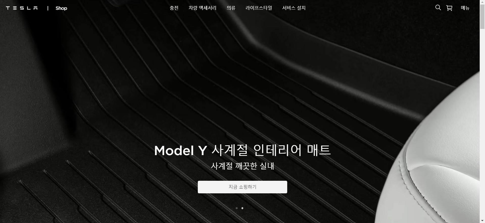
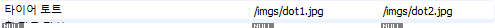
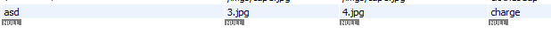

# 소녀시대(JJJJ) 팀 프로젝트

## **22.12.09 ~ 22.12.30**

## 0. :family: Team Members

- Leader : [장정현](https://github.com/JJeonghyun)
- Member : [김선주](https://github.com/KimSunJ)
- Member : [이재혁](https://github.com/LeeJaeHyekk)
- Member : [김영준](https://github.com/color99b)

- Team Notion : [notion](https://crystalline-lyric-a65.notion.site/Team-Project-b5b4c706da5f4e8299ffb3b4ad9769d6)

- Purpose Page

<br>



---

<br>

## 1. :computer: Project Description

- Intro

  > 기존의 목표 페이지를 토대로 회원가입을 통해 접속한 사용자들이 원하는 상품을 검색하거나 장바구니에 담아 편리하게 접근 할 수 있는 홈페이지 제작 계획

 <br>

---

## 2.:information_source: Project Information

- Purpose

  > Front기반의 React와 BackEnd기반의 Node.js(express) 및 DB를 결합한 웹 페이지 개발

     <br>

---

## 3. :satellite: Main Function

1. 회원관리

   > 회원가입, 로그인, 로그아웃

   > 마이페이지를 통해 성명, 주소, 전화번호 등 개인정보 수정 가능

 <br>

2. 상품 장바구니 관리 기능

   > 각 상품 별로 장바구니에 추가 기능

   > 개개인의 장바구니 내역

   > 상품 삭제 기능

 <br>

3. 상품 검색 기능

   > 사용자가 원하는 상품을 자유롭게 검색

   > 입력한 검색어를 포함한 상품들 전부 나열

 <br>

4.  상품 구매 기능

    > 사용자가 장바구니에 담은 전체 상품 구매

    > 체크아웃을 통해 구매한 내역을 마이페이지에서 확인 가능

 <br>

---

## 4. :floppy_disk: Skills

<br>


<br>
<br>

---

## 5.:recycle: Environment

<br>

> Visual Studio Code Version 1.73.1

> Node.js Version 16.14.2

> OS : Window x64 / MacOS : Ventura 13.1

<br>

---

## 6. :mag: Prerequisite / Usage

<br>

- In 'express' Directory (express)

  - 'config' Directory (config.json 내 password 설정)
    <br>
    <br>

  ```javascript
    {
      "development": {
        "username": "root",
        "password": "password 설정",
        "database": "tesla",
        "host": "127.0.0.1",
        "dialect": "mysql"
      },
      "test": {
        "username": "root",
        "password": "password 설정",
        "database": "tesla",
        "host": "127.0.0.1",
        "dialect": "mysql"
      },
      "production": {
        "username": "root",
        "password": "password 설정",
        "database": "tesla",
        "host": "127.0.0.1",
        "dialect": "mysql"
      }
  }

  ```

<br>

- In 'express' Directory (Express)

```
npm install
```

<br>

- In 'project' Directory (React)

```
yarn install
```

 <br>

---

## 7. :memo: Distributing Roles

<br>

- Main, Admin Pages

  -FrontEnd

  - :guardsman:장정현

    - 정적인 페이지

    - Header & Body & Footer Component 생성

    - 최상단 스크롤이 아닐때 Header color, background-color 조절

    - Header 왼쪽 클릭 시 (”/”) 주소로 메인 페이지 이동

    - Header 오른쪽 RightBanners 클릭 시 해당 컴포넌트로 이동 경로 설정

    - Body 컴포넌트 첫 슬라이드 부트스트랩 활용하여 구현

    - Body 컴포넌트의 두번째 슬라이드가 아닌 인기 상품를 임시 상품들로 플렉스화

    - Body 컴포넌트 마지막 영역은 임시 데이터를 넣어서 map를 이용하여 배열 하고 마지막으로 의류 관련 영역은 다시 컴포넌트화 하여서 배치

    - Header 상단 바에 오른쪽 배너에서 메뉴 라는 글씨를 대신하여 아이콘을 배치하고 해당 아이콘을 클릭 시 오른쪽에서 새로운 메뉴바가 나오고 메인 페이지는 임시적으로 반투명 효과 적용

    - 메뉴 아이콘이 적용된 후 눌렀을 때 나오는 오른쪽 메뉴바에 로그인 버튼을 추가하여 로그인(회원가입)이 가능한 페이지로 경로 설정

    - 메인페이지의 Header 가운데 Category들을 hover 시 해당 메뉴에 접근할 수 있는 dropdown 메뉴 목록 생성

    - 메인페이지의 Header 우측에 돋보기를 클릭하면 입력할 수 있는 검색창이 나타나고 다시 누르면 없어지는 기능 구현

    - 검색창에 입력된 값을 queryString에 담아 다른 페이지에서 입력한 값을 사용할 수 있도록 전달

    - 비로그인 시 장바구니를 클릭 해도 해당 페이지로 경로 이동 할 수 없도록 처리

    - Admin Page 기본 정적은 UI 구조 계획 및 구현

    - 입력할 Input 태그들 계획 및 생성

    - 반응형 웹페이지 구현

    - 기타 보수 작업

  -BackEnd

  - :guardsman:장정현

    - 메인 페이지에서 유저로그인 || 관리자 로그인 쿠키를 통해 확인 후 상품등록 가능한 메뉴 버튼 출력 유무 조절

    - 메인 페이지 세번째 영역에서 지금 쇼핑하기 버튼을 눌러서 Category별로 이동할 수 있게 경로 설정

    - multer 라이브러리를 통한 모든 입력값 axios 통신

    - express server 저장된 product.json 파일을 읽고 axios 통신으로 받은 데이터 배열을 관리 상품 목록 페이지

    - 관리자 이메일과 비밀번호를 입력하면 관리자 페이지로 이동할 수 있도록 설정

    - 관리자 페이지에서 전체 상품들을 관리할 수 있는 관리자 상품 목록 페이지

     <br>

- Regist, LogIn, LogOut Pages

  -FrontEnd

  - :woman:김선주

    - 정적인 UI 구조

    - 각각의 입력 창에 대한 예외처리는 정규표현식을 이용, test 메서드를 통하여 경고 메시지 출력

    - 가입완료 시 로그인 페이지로 이동

    - 회원가입 페이지에서도 메인페이지(”/”)으로 갈 수 있게 Header추가

    - Enter 계정 생성하기 onClick

    - 이메일을 작성하고 다음 버튼을 누르면 이메일이 로그인 관련 모듈에 저장

    - 비밀번호를 입력하고 로그인 버튼을 누르면 가입한 모듈의 회원정보들을 가지고 와서 이메일과 교 후 일치한 정보들이 있으면 메인페이지로 이동

    - 로그인 페이지에서도 메인페이지(”/”)으로 갈 수 있게 Header추가

    - Enter 키로 로그인 가능

    - 기타 보수 작업

  -BackEnd

  - :woman:김선주 :guardsman:장정현

    - 회원가입 시 중복가입을 막기 위한 처리

    - 회원가입 시 DB 저장(해당 column들을 만들어 저장)

    - 로그인 시 입력한 정보들이 ( 이메일과 비밀번호 ) 일치 하지 않으면 이동 안되게 예외처리

     <br>

- Search, Cart Pages

  -FrontEnd

  - :man:이재혁

    - react-css 기본틀 잡기

    - 서치페이지 정적인 페이지 구현

    - Search Page 의 물품 List 형식 반환

    - 검색 Input 창의 결과를 Search Page에 전달

    - Search Page 검색 결과에 따른 물품 배치

    - Search 로직구현

    - Search 물품 상세페이지 연결

    - 부분적으로도 검색이 되는 search 로직

  -BackEnd

  - :man:이재혁 :baby:김영준

    - Search Page 검색 결과 정보 전달

    - Cart Page 물품 List 형식 반환

    - Cart Page 물품 List 제겨 기능 구현

    - Cart Page json 파일 연결

    - Cart Page 수량 , 갯수에 따른 가격 연결(수량)

     <br>

- Cart, Chart Pages

  -FrontEnd

  - :baby:김영준

    - 이미지 슬라이드 -좌우 버튼으로 슬라이드 페이지 조절 -이미지 밑에 쪽수 컴포넌트 생성 -이미지 사진으로도 슬라이드 페이지 조절

    - 상품에 따른 고유 router query 주소값 구현

    - 장바구니 목록을 list 화 하는 컴포넌트 제작

    - media query를 통한 반응형 구현

  -BackEnd

  - :baby:김영준 :man:이재혁

    - 체크아웃 button 클릭 시 해당 장바구니 내역들 주문내역 테이블로 이동되면서 장바구니 테이블에서 삭제

    - DB에서 data 받아와 이미지 슬라이드 및 상품 정보 구현

    - 장바구니 수량에 따른 가격의 변화 구현 → 주문서에 총합 금액변화까지

    - 장바구니 목록을 제거하는 기능 구현

    - 장바구니 목록과 DB의 연결

    - 장바구니 DB와 배열 cartList 연결

   <br>

- User Mypage, Order Pages

  -FrontEnd

  - :woman:김선주

    - 유저의 마이페이지에서 접근할 수 있는 배너의 경로 설정

    - 정적인 UI 페이지 구조 및 구현

  -BackEnd

  - :woman:김선주 :guardsman:장정현 :baby:김영준

    - 장바구니에 담은 상품들이 체크아웃을 눌렀을 때 db Order 테이블에 생성

    - Order 테이블에 들어간 상품들은 Cart 테이블에서 제거

    - Order 테이블에 담긴 정보들을 Front에 정상적으로 출력

     <br>

---

<br>

## 8.:open_file_folder: Git Branch Division

- main

  - dev

    - itemInfo
      > - itemInfo UI 완성, orderPage UI완성
    - search
      > - 검색페이지 정적인 기본틀, 검색 품목들 배열방식으로 구조 설계
    - regist
      > - 회원가입 페이지 UI 관련
    - cart
      > - 장바구니 페이지 UI
    - mainpage
      > - 메인 홈페이지 UI 관련
    - dropdown
      > - Header 카테고리 애니메이션 추가
    - productList, gallery
      > - dummy json파일과 검색결과 페이지 연결
    - userclone
      > - 회원가입, 로그인, 로그아웃 기능 구현
    - chartpage
      > - 차트페이지 라이브러리 추가
    - hover
      > - 상품 이미지 마우스 호버 시 다른 이미지 출력 기능 구현
    - adminlist
      > - 관리자 상품목록 페이지 UI 추가
    - multerdb
      > - 관리자 상품등록 후 DB 연동 기능 구현
    - cartdb
      > - 장바구니 페이지 DB 연동 구현
    - cartback
      > - 장바구니 페이지 express 통신 구현
    - productpage
      > - 상품상세페이지 Header, Footer Comp 연결
    - associate
      > - Database 각 테이블별 관계형 설정
    - auth
      > - 유저 정보 db에 추가하는 기능 구현
    - backback
      > - 검색결과페이지 상품 이미지 박스 조절
    - routing
      > - 전체페이지 경로 재 설정
    - cart-exception, checkcart
      > - 장바구니 페이지 예외처리
    - user
      > - 기존에 있던 loginNext 폴더 삭제
    - adcookie
      > - 관리자 전용 쿠키 생성 및 삭제 기능 구현
    - cookies
      > - 사용자와 관리자 두개의 쿠키 생성 및 삭제 구현
    - authdb
      > - 사용자 비밀번호 관련
    - cookieking
      > - 각 페이지에서 쿠키 여부 판단 기능 구현
    - cart-order
      > - 장바구니의 주문창 기능 추가
    - adminui
      > - 관리자 페이지 UI 보강
    - totalPrice
      > - 장바구니 페이지의 주문창 총 가격 계산 기능 추가
    - pm

      > - 프로젝트 전체 총괄 기능 보수

    - chartPage

      > - 상세페이지 UI 수정

    - cartcart, goodcart

      > - 장바구니페이지 관련 보완

    - authuser

      > - 유저 마이페이지 구매내역 페이지 추가

    - responweb

      > - 메인페이지 및 관리자 페이지 반응형 웹페이지 구현

    - mediaQuery-cart

      > - 장바구니 주문영역 반응형 웹페이지 구현
      >   <br>

---

## 9.:collision: Issues Objects

<br>

> 정현
>
> - 이슈사항 1)
>
>   - (22.12.11) 기존에 ES6 이전 문법으로 연동 했었던 DB(sequelize) 문법을 가져오면서 ES6문법(import, from) 형식으로 바꿈에 있어서 config폴더 내에 config.json 형식의 파일을 인식 하지 못해 DB가 제대로 연결되 않았다.
>
>   - 해결
>
> ```javascript
>           assert { type: "json" };
>           import Config from "../config/config.json" assert { type: "json" };
>           const config = Config[env];
> ```
>
> - 이슈사항 2)
>
>   - (22.12.15) 프론트에서 로그인 시 axios 통신을 이용하여 백엔드 서버에 요청을 주고 해당 요청에 대한 정보들이 일치하면 res.cookie를 통해 jwt로 쿠키를 생성 하였다. 이후 백엔드 서버에서 프론트react쪽으로 통신에 응답하였지만, 쿠키가 생각했던대로 보여지지 않았다. 자세히 보니 네트워크 쪽 쿠키는 넘어왔지만 애플리케이션 쪽에서 확인 불가 했었다.
>
>   - 해결 : React 최상위 index.js과 express 최상위 index.js에 필요한 코드 추가
>
> ```javascript
> axios.defaults.withCredentials = true;
>
> app.use(cors({ origin: "http://localhost:3000", credentials: true }));
> ```
>
> - 이슈사항 3)
>
>   - (22.12.19) 기존에 사용했던 dummy 데이터 파일 (product.json) axios 통신해서 json파일 전체를 forEach메서드를 통해 통신 할 때 마다 json파일을 읽고 db에 Product 테이블에 데이터와 상관없이 매번 데이터 삽입되는 이슈 발생
>
>   - 해결: axios 통신을 하여 Product 테이블에 데이터가 없으면 dummy 파일 읽고 컬럼명에 맞춰서 create문으로 데이터 삽입 아니면 Product 테이블 전체 findAll 한 리스트를 프론트 쪽으로 응답해준다.

> 선주
>
> - 이슈사항 1)
>
>   - (22.12.12) html / css 와는 다르게 img 태그에 hover 시 바로 반응하지 않는다.
>
>   - 해결 : 리액트에서의 hover는 부모 태그를 통해 자식 태그에 적용되는 것으로 img 태그는 자식 태그를 갖지 못하기에 부모 태그를 갖게 함으로 hover 가 작동되는 것을 볼 수 있었다.
>
> - 이슈사항 2)
>
>   - (22.12.27) 반응형 페이지 구현 시 @media only screen and(max-width: **_px) 와 @media only screen and(min-width: _**px)를 같이 사용할 경우 반응형이 원하는 대로 적용되지 않았다
>
>   - 해결 : @media only screen and(max-width: \*\*\*px)로 통일하여 사용했다.
>
> - 이슈사항 3)
>
>   - (22.12.28) 로그인 정보 수정하기 클릭 시 useState("로그인 정보")로 설정해도 수정을 위한 모달창 input 값이 유저의 정보가 기본값으로 들어있지 않고 빈 값으로 되어 있는 문제 발생한다.
>
>   - 해결 : useState에서만 설정할 경우 빈값으로 들어왔다가 버튼을 클릭할때마다 실행되지 않기 때문에 useEffect로 값을 넣는 함수를 한번 더 실행해줘야 한다.

> 재혁
>
> - 이슈사항 1)
>   - static 구조에 프롭스로 전달된 정보를 일일이 받았다가 , 빈배열을 만들어 정보를 전부 받아 전달함.
>   - 해결 :
>
> ```javascript
> cartList.map((item,index)=>{CartPageBox key={`cartpagebox-${index}`})
> ```
>
> - 이슈사항 2)
>
>   - cartPage 의 tempArr의 배열의 값을 useState로 상태저장
>   - 해결 : const [cartList, setCartList] = useState([]);
>
> ```javascript
>        .then((data) => {setCartList(data.data.list);
>         console.log(cartList);
>         let tempTotal >= 0;
>        data.data.list?.map((item, index) => {tempTotal += item.Product.productPrice * item.account;})});
> ```
>
> - 이슈사항 3)
>
>   - input 태그에 CSS -> {&:hover>div:nth-child(2){}} 로 그림에 마우스가 올라갔을때 장바구니가기 창을 띄울때 여러개가 동시에 적용됨
>   - 해결 : div를 기준으로 :hover를 적용하고, 장바구니 첫번째 보여지는 div를 안보이게 하고 hoverImg를 고정한다.
>
> ```css
> &:hover > div:first-child {
>    display: none;
>  }
>  &:hover > div:last-child {
>    display: block;
>    cursor: pointer;
>    object-fit: cover;
> ```
>
> - 이슈사항 4)
>
>   - json을 import 하지 못하여 인식 하지 못하는 이슈
>   - 해결 : assert로 json 파일을 인식하게 해준다
>
> ```javascript
> import productJson from "../data/product.json" assert { type: "json" };
> ```
>
> - 이슈사항 5)
>
>   - Redux (List ADD , Remove , Select ) 각각 기능구현중 dispatch 사용법
>   - 해결 : dispatch 통신 방식 action에 대한 이해
>
> ```javascript
> const dispatch = useDispatch();
> dispatch(action.listAdd(name, price, account, img,hoverImg))
> ---------------------------------------------------------------
> onClick={async () => {
>                dispatch(action.listAdd(name, price, account, img, hoverImg));}}
> ```
>
> - 이슈사항 6)
>
>   - query로 가져온걸 product.forEach((item)⇒{product.create({목록})}) 형태로 DB연결
>   - 해결 : DB sequelize 문법 create 공부
>
> ```javascript
> Cart.create({
>   name: productInfo.productName,
>   price: productInfo.productPrice,
>   img: productInfo.productImg,
>   hoverImg: productInfo.productHoverImg,
>   account: 10,
>   productId: productInfo.id,
> });
> ```
>
> - 이슈사항 7)
>
>   - where:{} , setList{temp.data.mainresult} , 등으로 DB의 목록과 검색결과 매칭
>   - 해결 : Op 문법을 공부하고 substring 문법을 이용
>
> ```javascript
>      const { Op } = require("sequelize");
>     [Op.and] () AND () , [Op.or] () OR () , [Op.substring] () LIKE '%()%'
>     where: { productName: { [Op.substring]: result } },
> ```
>
> - 이슈사항 8)
>
>   - 빈칸 검색시 전체상품으로 이동
>   - 해결 : action에 조건으로 검색 결과가 없으면 정체 페이지로 이동하게 만듬
>
> ```javascript
> {
>   !isSearch || (
>     <form
>       method="get"
>       action={search ? `/search? searchTerm=${search}` : "/all"}
>     >
>       <input
>         type="text"
>         name="search"
>         value={search}
>         onInput={(e) => {
>           setSearch(e.target.value);
>         }}
>         placeholder="검색어를 입력해 주세요"
>       ></input>
>     </form>
>   );
> }
> ```
>
> - 이슈사항 9)
>
>   - media query font-size :1rem 의 기준을 바꾼다.
>   - 해결 : font-size를 1rem으로 적고 media query 조건 상황에 따라 변화하게 한다.
>
> ```javascript
> html {
>   font-size: 16px;
> }
> @media only screen and (min-width: 1550px) {
>   html {
> font-size: 21px;
> }}
> ```

> 영준
>
> - 이슈사항1 (22.12.20)
>   - DB에서 정보를 가져올 때 findAll 이 아닌 findOne 으로 찾는 조건문의 문법이 굉장히 헷갈렸다.
>   - 해결 : findOne( {where: { 찾을 조건 } } )
>
> ```javascript
> const temp = await Cart.findOne({ where: { name: req.body.payload.name } });
> ```
>
> - 이슈사항 2 (22.12.21)
>
>   - (22.12.21) CSS 적용을 id, className, 직접 지정 섞어서 쓰다보니 적용이 원활하게 되지 않음.
>   - 해결 : CSS 적용 우선 순위 공부. 출처 : https://think0wise.tistory.com/24
>   - 우선도 {inline > id > class, sudoClass > tag, element}
>   - 이왕이면 class로 수정되지 않는 스타일 바꾸기 위해 id를 강제로 넣는 건 지양.
>
> - 이슈사항 3 (22.12.22)
>   - DB에 저장된 list를 받아 물건을 출력할 때 Multer library 로 DB에 등록한 상품의 사진을 불러오지 못한다.
>     DB에 밀어넣은 정보는 이미지의 경로가 폴더 절대주소로 설정되는 반면
>       
>      multer 로 올린 정보의 이미지는 경로가 파일 이름만 설정된다.
>     
>   - 해결 : DB에 저장된 img 의 경로가 imgs 폴더 주소를 포함하고 있을 때와, 파일 이름만 있을때를 나누어서 불러온다.
>     multer 로 업로드한 파일은 서버폴더의 upload에 올라가게끔 설정을 했다.
>
> ```javascript
> // 삼항연산자 사용 (productImg 값에 /imgs를 포함 ? 포함할때  : 포함 안할때 )
> {
>   item.productImg.includes("/imgs");
> }
> ```
>
> 참고문헌:
> https://any-ting.tistory.com/51
>
> - 이슈사항 5 (22.12.23)
>   - 테이블간 관계 DB 설계에 어려움을 겪었다.
>     User, Cart, Product, Order 등 각각의 테이블에 모든 상품정보와 유저정보를 넣어서 하나하나 관리하는 건 비효율적이기도 하고, 유지보수도 어렵기에 관계설정이 필수적이었다.
>   - 해결 : User, Product 테이블을 기준으로 userId와 productId를 엮어서 Cart,Order,UserProduct 테이블에 관계시켰다.
>
> ```javascript
> // Cart Table
> static associate(db) {
>   db.Cart.belongsTo(db.User, { foreignKey: "userId", targetKey: "id" });
>   db.Cart.belongsTo(db.Product, { foreignKey: "productId", targetKey: "id" });
> }
> }
> ```
>
> ```javascript
> // Product Table
> static associate(db) {
>   db.Product.belongsToMany(db.User, {
>    through: "userProduct",
>    foreignKey: "productId",
>  });
>  db.Product.hasMany(db.Cart, {
>    foreignKey: "productId",
>    sourceKey: "id",
>  });
>  db.Product.hasMany(db.Order, {
>    foreignKey: "productId",
>    sourceKey: "id",
>   });
> }
> }
> ```
>
> ```javascript
> // User Table
> static associate(db) {
> db.User.belongsToMany(db.Product, {
>  through: "userProduct",
>   foreignKey: "userId",
>  });
>  db.User.hasMany(db.Cart, { foreignKey: "userId", sourceKey: >"id" });
>  db.User.hasMany(db.Order, { foreignKey: "userId", >sourceKey: "id" });
> }
> }
> ```
>
> - 이슈사항 6 (22.12.24)
>
>   - 관계가 형성된 테이블 속 data에 접근하는 방법에서 어려움을 겪었다. 단순한 findOne, findAll 이 아닌 다른 문법이 필요해 보였다.
>   - 해결 : 하위 속성으로 include 문법을 사용한다.
>
>   - code
>
> ```javascript
> /// Cart 테이블의 userid 와 매칭되는 user테이블의 항목의 attributes와 productid 와 매칭되는 product 테이블 항목의 attributes를 가져온다.
> const temp = await Cart.findOne({
>   where: { userId: tempUser.id, productId: tempProduct.id },
>   include: [
>     {
>       model: Product,
>       attributes: [
>         "productName",
>         "productPrice",
>         "productImg",
>         "productHoverImg",
>       ],
>     },
>     {
>       model: User,
>       attributes: ["userEmail"],
>     },
>   ],
> });
> ```
>
> 참고문헌 : https://gist.github.com/zcaceres/83b554ee08726a734088d90d455bc566
>
> - 이슈사항 7 (22.12.26)
>
>   - async, await 를 통한 비동기 처리를 할 때 await 문 다음 logic이 먼저 실행되면서, await로 back에서 가져오는 정보를 읽지 못하는 문제가 발생.
>   - 해결 : await 문 대신에 axios 통신 .then(()=>{}).catch(err) 문을 사용(통신문이 끝나면 실행한다)
>
>   - ex:
>
> ```javascript
> const dbRemove = function (index, productId) {
>   axios
>     .post("/api/cart/remove/", {
>       payload: { index: index, productId: productId },
>     })
>     .then(() => {
>       userCart();
>     })
>     .catch((err) => {
>       console.log(err);
>     });
> };
> ```

<br>

## 10. :page_with_curl: Reference Things

> - React-Bootstrap : https://react-bootstrap.github.io/
>
> - Google ReCaptcha : https://www.npmjs.com/package/react-google-recaptcha-v3
>   (테슬라 페이지 svg Recaptcha 대체안)
>
> - 브랜치 삭제 관련 : https://velog.io/@minjeong/git-브랜치-삭제하기
>
> - github readme.md 이모지 관련 : https://www.webfx.com/tools/emoji-cheat-sheet/
>
> - github readme.md 이미지관련 : https://simpleicons.org/
>
> - Notion 아이콘 및 이미지 관련 GIPHY : https://giphy.com/
